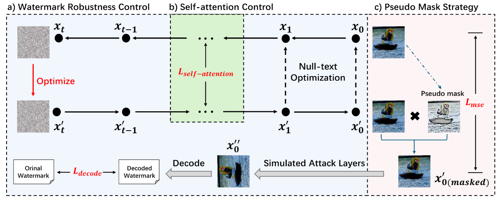

# ONRW: Optimizing inversion noise for high-quality and robust watermark



* We leverage the excellent image generation and purification defense capabilities of the diffusion model's iterative denoising process to propose a novel watermarking framework. This framework optimizes the inversion noise in the latent space of the diffusion model to embed the watermark into the image, allowing for watermark embedding without the need for additional training.
* We introduce self-attention constraints, pseudo-mask strategies, and simulated attack layers into the null-text optimization process of the basic diffusion model. This combination not only improves the effectiveness of watermark processing, but also enhances its resistance to various attacks, ensuring that embedded watermarks remain detectable even under challenging conditions.
* Extensive experiments demonstrate that our proposed method exhibits higher robustness against various attacks, including image transformations and deliberate distortions, compared to existing watermarking methods.


## Installation
  ```bash
  conda create -n ONRW python=3.9
  conda activate ONRW
  pip install -r requirement.txt
  ```


## 1. Scripts of ONRW
- To try our watermarking method, use:
  ```bash
  python SLM.py
  ```
## 2. Scripts of evaluation
- To evaluate the image quality, use:
  ```bash
  python mse.py
  python psnr.py
  ```

- To evaluate the watermark robustness, use:
  ```bash
  python evaluate.py
  ```


## License
- The intended use is strictly limited to research and non-commercial projects.
